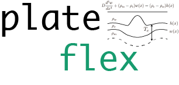

## Software for mapping the effective elastic thickness of the lithosphere

The flexure of elastic plates is a central concept in the theory of plate tectonics,
where the Earth's lithosphere (crust and uppermost mantle) reacts to applied loads 
by bending, a process referred to as flexural isostasy. Estimating the *effective* 
elastic thickness (<i>Te</i>) of the lithosphere (thickness 
of an equivalent ideal elastic plate) gives important clues on the rheology of the 
lithosphere and its thermal state. Estimating <i>Te</i> can be done by 
modeling the cross-spectral properties (admittance and coherence) between topography 
and gravity anomaly data, which are proxies for the distribution of flexurally 
compensated surface and subsurface loads. 

This package contains `python` and `fortran` modules to calculate the wavelet spectral
and cross-spectral quantities of 2D gridded data of topography and gravity anomalies.
Once obtained, the wavelet cross-spectral quantities (admittance and coherence) are
used to determine the parameters of the effectively elastic plate, such as the 
effective elastic thickness (<i>Te</i>), the initial subsurface-to-surface
load ratio (<i>F</i>) and optionally the initial phase difference between
surface and subsurface loads (<i>alpha</i>). The estimation can be done using non-linear 
least-squares or probabilistic (i.e., bayesian) inference methods. The analysis can 
be done using either the Bouguer or Free air gravity anomalies, and
over land or ocean areas. Computational workflows are covered in the Jupyter 
notebooks bundled with this package. The software contains methods to make 
publication-quality plots using the `seaborn` package.

Installation, Usage, API documentation and Jupyter Notebooks are described at 
https://paudetseis.github.io/PlateFlex/

Authors: [`Pascal Audet`](https://www.uogeophysics.com/authors/admin/) (Developer and Maintainer) & [`Zhezhe Lu`](https://www.uogeophysics.com/authors/lu/) (Contributor)

#### Citing

If you use `PlateFlex` in your work, please cite the [Zenodo DOI](https://zenodo.org/badge/latestdoi/206867590).
<!-- and the following paper:

- Audet, P., Thomson, C.J., Bostock, M.G., and Eulenfeld, T. (2019). Telewavesim: 
Python software for teleseismic body wave modeling. Journal of Open Source Software, 
4(44), 1818, https://doi.org/10.21105/joss.01818
 -->
#### Contributing

All constructive contributions are welcome, e.g. bug reports, discussions or suggestions for new features. You can either [open an issue on GitHub](https://github.com/paudetseis/PlateFlex/issues) or make a pull request with your proposed changes. Before making a pull request, check if there is a corresponding issue opened and reference it in the pull request. If there isn't one, it is recommended to open one with your rationale for the change. New functionality or significant changes to the code that alter its behavior should come with corresponding tests and documentation. If you are new to contributing, you can open a work-in-progress pull request and have it iteratively reviewed.

Examples of straightforward contributions include notebooks that describe published examples of elastic thickness
results. Suggestions for improvements (speed, accuracy, etc.) are also welcome.

#### References

- Audet, P. (2014). Toward mapping the effective elastic thickness of planetary lithospheres
from a spherical wavelet analysis of gravity and topography. Physics of the Earth and Planetary Interiors, 226, 48-82. https://doi.org/10.1016/j.pepi.2013.09.011

- Kalnins, L.M., and Watts, A.B. (2009). Spatial variations in effective elastic thickness in the Western Pacific Ocean and their implications for Mesozoic volcanism. Earth and Planetary Science Letters, 286, 89-100. https://doi.org/10.1016/j.epsl.2009.06.018

- Kirby, J.F., and Swain, C.J. (2009). A reassessment of spectral Te estimation in continental interiors: The case of North America. Journal of Geophysical Research, 114, B08401. https://doi.org/10.1029/2009JB006356

- Kirby, J.F. (2014). Estimation of the effective elastic thickness of the lithosphere using inverse spectral methods: The state of the art. Tectonophysics, 631, 87-116. https://doi.org/10.1016/j.tecto.2014.04.021

#### Use cases

- Lu, Z., Li, C.-F., Zhu, S., and Audet, P. (2020). Effective elastic thickness over the Chinese mainland and surroundings estimated from a joint inversion of Bouguer admittance and coherence. Physics of the Earth and Planetary Interiors, 301, 106456, https://doi.org/10.1016/j.pepi.2020.106456
